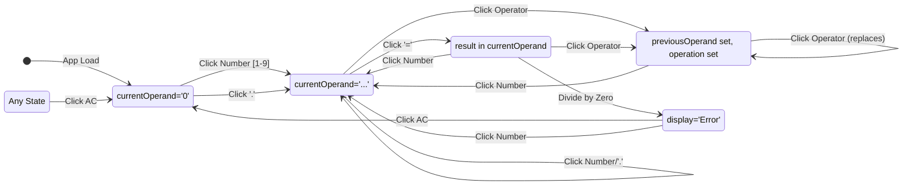

Of course. As a Principal Software Architect, I have produced the following technical architecture document based on the feature request and the provided Product Requirements Document (PRD). This document provides a complete and actionable plan for implementation.

---

## **Technical Architecture Document: Simple Calculator App**

| **Document Version** | **Date**         | **Author**                    | **Status** |
| ------------------ | ---------------- | ----------------------------- | ---------- |
| 1.0                | October 26, 2023 | Principal Software Architect  | **Final**  |

### **1. Architecture Overview**

This document outlines the technical architecture for a simple, web-based calculator. The architecture is intentionally minimalist to prioritize performance, simplicity, and zero dependencies, in direct alignment with the PRD.

The system will be a **Monolithic Front-end Application**, also known as a Single Page Application (SPA). It will be composed of three static files: `index.html` for the structure, `styles.css` for presentation, and `script.js` for all application logic and state management. This client-only architecture ensures instantaneous load times and operation, as no network requests are required for core functionality.

The design pattern is a simple variation of Model-View-Controller (MVC):
*   **Model:** The JavaScript state object (`calculatorState`).
*   **View:** The `index.html` file, which provides the DOM structure, and `styles.css`, which defines the visual appearance. The view is updated by the controller.
*   **Controller:** The JavaScript functions in `script.js` that listen for user events (button clicks), update the model (state object), and re-render the view (update the display).

### **2. Component Diagram (Text)**

The UI will be constructed from a set of logical components nested within a main container. The layout will be managed using CSS Grid and Flexbox for a responsive and clean structure.

```plaintext
+-------------------------------------------------+
|              <main class="calculator">          |
|-------------------------------------------------|
|  +-------------------------------------------+  |
|  |         <div class="display-panel">       |  |
|  |          [ 0 ]                            |  |
|  +-------------------------------------------+  |
|                                                 |
|  +-------------------------------------------+  |
|  |            <div class="button-grid">      |  |
|  |                                           |  |
|  |  +----+ +----+ +----+      +-----------+  |  |
|  |  | AC | | +/-| | %  |      | Operator  |  |  |
|  |  +----+ +----+ +----+      | Pad (/)   |  |  |
|  |                            +-----------+  |  |
|  |  +----+ +----+ +----+      +-----------+  |  |
|  |  | 7  | | 8  | | 9  |      | Operator  |  |  |
|  |  +----+ +----+ +----+      | Pad (*)   |  |  |
|  |       NumberPad            +-----------+  |  |
|  |  +----+ +----+ +----+      +-----------+  |  |
|  |  | 4  | | 5  | | 6  |      | Operator  |  |  |
|  |  +----+ +----+ +----+      | Pad (-)   |  |  |
|  |                            +-----------+  |  |
|  |  +----+ +----+ +----+      +-----------+  |  |
|  |  | 1  | | 2  | | 3  |      | Operator  |  |  |
|  |  +----+ +----+ +----+      | Pad (+)   |  |  |
|  |                            +-----------+  |  |
|  |  +---------+ +----+        +-----------+  |  |
|  |  |    0    | | .  |        | Controls  |  |  |
|  |  +---------+ +----+        | Pad (=)   |  |  |
|  |                            +-----------+  |  |
|  +-------------------------------------------+  |
|                                                 |
+-------------------------------------------------+
```
*Note: The diagram above is a conceptual layout. The final implementation will map the PRD's required components (`NumberPad`, `OperatorPad`, `ControlsPad`) onto this grid.*

### **3. Technology Stack**

The technology stack is chosen for its ubiquity, performance, and lack of external dependencies.

| Technology           | Version | Justification                                                                                                 |
| -------------------- | ------- | ------------------------------------------------------------------------------------------------------------- |
| **HTML5**            | 5       | Provides the semantic structure for the application, ensuring accessibility and a stable DOM for manipulation.  |
| **CSS3**             | 3       | Used for all styling. **CSS Grid** and **Flexbox** will be used to create the responsive calculator layout.       |
| **JavaScript (JS)**  | ES6+    | Vanilla JavaScript will be used for all application logic, state management, and DOM manipulation. No frameworks or libraries are permitted, per the PRD, to ensure the smallest possible footprint and fastest execution. |

### **4. Service Breakdown**

This is a monolithic client-side application and does not contain distributed services. The "services" are logical function modules within `script.js`.

| Module/Function Name  | Responsibility                                                                                                                                                                                                                         | Inputs                               | Outputs / Side Effects                                                                                             |
| --------------------- | -------------------------------------------------------------------------------------------------------------------------------------------------------------------------------------------------------------------------------------- | ------------------------------------ | ------------------------------------------------------------------------------------------------------------------ |
| `appendNumber(number)`| Appends a digit or decimal point to the `currentOperand` in the state. Handles logic for leading zeros and duplicate decimals.                                                                                                             | `number` (string)                    | Modifies `state.currentOperand`. Calls `updateDisplay()`.                                                          |
| `chooseOperation(op)` | Sets the pending `operation`. Manages moving `currentOperand` to `previousOperand`. If an operation is already pending, it first computes the result before setting the new operation (to support chaining). Handles operator replacement. | `op` (string: '+', '-', '*', '/')    | Modifies `state.operation`, `state.previousOperand`, `state.currentOperand`. Calls `updateDisplay()`.              |
| `compute()`           | Calculates the result of `previousOperand operation currentOperand`. Handles the "Division by Zero" error case.                                                                                                                          | (None)                               | Modifies `state.currentOperand` with the result, resets `state.previousOperand` and `state.operation`. Calls `updateDisplay()`. |
| `clear()`             | Resets the entire calculator state to its default initial values.                                                                                                                                                                      | (None)                               | Resets all properties in the `state` object. Calls `updateDisplay()`.                                              |
| `updateDisplay()`     | Renders the current state to the DOM. It reads from the state object and updates the text content of the `DisplayPanel` element.                                                                                                         | (None)                               | Modifies the DOM (`innerText` of the display element).                                                             |
| `init()`              | Initializes the application by setting up all button event listeners. This function will run once when the script is loaded.                                                                                                             | (None)                               | Attaches event listeners to all calculator buttons.                                                                |

### **5. Data Architecture**

#### **Database and Data Storage**
There is no database or persistent storage. All application data is ephemeral and exists only in the client's memory for the duration of the page session.

#### **State Management Object**
The entire state of the application will be managed by a single JavaScript object. This object serves as the "single source of truth."

```javascript
// Located in script.js
const calculatorState = {
  currentOperand: '0',    // String: The number being typed or the most recent result.
  previousOperand: null,  // String: The operand stored after an operator is pressed.
  operation: null,        // String: The selected operator ('+', '-', '*', '/').
  displayNeedsReset: false // Boolean: True if the next number input should overwrite the display (e.g., after pressing '=' or an error).
};
```

#### **Data Flow Diagram**
The following state diagram illustrates how user actions transition the application through different states by modifying the `calculatorState` object.



### **6. API Design**

There is no external, network-facing API. The "API" for this application is the internal contract between the event listeners and the core logic functions defined in **Section 4 (Service Breakdown)**. Event listeners attached to the HTML buttons will directly call these JavaScript functions, forming a clear and self-contained system.

### **7. UI/UX Structure**

The application consists of a single screen.

*   **Screen Name:** Calculator View
*   **Purpose:** To allow users to perform basic arithmetic calculations quickly and efficiently.
*   **Key Components:**
    *   `DisplayPanel`: A non-interactive `div` at the top, showing input and results.
    *   `NumberPad`: A grid of `<button>` elements for digits 0-9 and the decimal point.
    *   `OperatorPad`: A column of `<button>` elements for `+`, `-`, `*`, `/`.
    *   `ControlsPad`: `<button>` elements for `AC` (All Clear) and `=` (Equals).
*   **User Actions Available:**
    *   Click on a number button to append it to the current operand.
    *   Click on an operator button to select an operation.
    *   Click on the equals button to compute the result.
    *   Click on the AC button to reset the calculator.

#### **Visual Mockup (Wireframe) & Styling**

A clean, high-contrast, dark-themed design is proposed for modern aesthetics and readability.

*   **Layout:** A fixed-size calculator centered on the page. CSS Grid will be used for the button layout.
*   **Color Scheme:**
    *   **Background:** Very Dark Gray (`#212121`)
    *   **Display:** Same as background, with bright white text.
    *   **Number/Control Buttons:** Medium Gray (`#424242`), white text.
    *   **Operator Buttons:** Accent Orange (`#FF9800`), white text.
    *   **Button Hover/Active:** Slightly lighter shade of the button's base color.

```plaintext
+----------------------------------------+
|       SIMPLE CALCULATOR                |
+----------------------------------------+
|                                        |
|  +----------------------------------+  |
|  | [ 20 ]<--------------------------|--|-- Display Text (White)
|  +----------------------------------+  |
|                                        |
|  +------+------+------+------+       |
|  |  AC  |  +/- |   %  |   /  | <-----|---- Operator Button (Orange)
|  +------+------+------+------+       |
|  |  7   |  8   |   9  |   *  |       |
|  +------+------+------+------+       |
|  |  4   |  5   |   6  |   -  | <-----|---- Number Button (Gray)
|  +------+------+------+------+       |
|  |  1   |  2   |   3  |   +  |       |
|  +------+------+------+------+       |
|  |      0      |  .   |   =  |       |
|  +-------------+------+------+       |
|                                        |
+----------------------------------------+
```

### **8. Infrastructure & Deployment**

#### **Hosting**
The application will be deployed as a set of static assets (`index.html`, `styles.css`, `script.js`). The recommended hosting platform is **GitHub Pages**, due to its simplicity, cost-effectiveness (free), and integration with the source code repository. Alternatives include Netlify, Vercel, or an AWS S3 bucket configured for static website hosting.

#### **CI/CD Pipeline**
A simple CI/CD process can be established using GitHub Actions.
1.  **Trigger:** A push or merge to the `main` branch.
2.  **Build Step:** (Optional) A step can be added to lint the code (e.g., using ESLint) or run automated tests if they are added in the future. For this simple project, this step can be omitted initially.
3.  **Deploy Step:** The `github-pages-deploy-action` or a similar tool will be used to automatically publish the contents of the repository to the `gh-pages` branch, making it live.

This setup ensures that every change merged into `main` is automatically deployed, enabling rapid iteration.

### **9. Security Considerations**

While the security risks for a client-side-only calculator are low, we will adhere to best practices.

1.  **No `eval()`:** The calculation logic in the `compute()` function **must not** use the `eval()` function. `eval()` poses a significant security risk by allowing arbitrary code execution. Instead, a `switch` statement or an object lookup will be used to perform the correct arithmetic operation based on the `operation` state property.
2.  **Input Sanitization:** While not strictly necessary for this application (as inputs are limited to numbers and operators from trusted buttons), the logic will inherently handle invalid inputs (e.g., multiple decimals) by design.
3.  **Content Security Policy (CSP):** If hosted, a basic CSP header can be configured to prevent the loading of untrusted scripts, further hardening the application. `default-src 'self'` would be a good starting point.

### **10. Architecture Risks**

1.  **Scalability of Codebase:** The choice of a single vanilla JavaScript file (`script.js`) is optimal for the current scope but presents a risk if the project's complexity grows. Adding significant new features (e.g., scientific modes, history, unit conversions) would make this monolithic file difficult to maintain.
    *   **Mitigation:** This is an accepted trade-off. If the product roadmap expands, a migration to a component-based framework (like React, Vue, or Svelte) would be the next logical architectural step. The current design is not intended to scale to that level.
2.  **Lack of Order of Operations (PEMDAS):** The PRD explicitly requires sequential, left-to-right evaluation (e.g., `2 + 3 * 4 = 20`). This is a known deviation from standard calculator behavior.
    *   **Mitigation:** This is a product decision, not a technical risk. The implementation will strictly follow the PRD. The risk is a potential for user confusion, which is a UX concern outside the scope of this technical document.