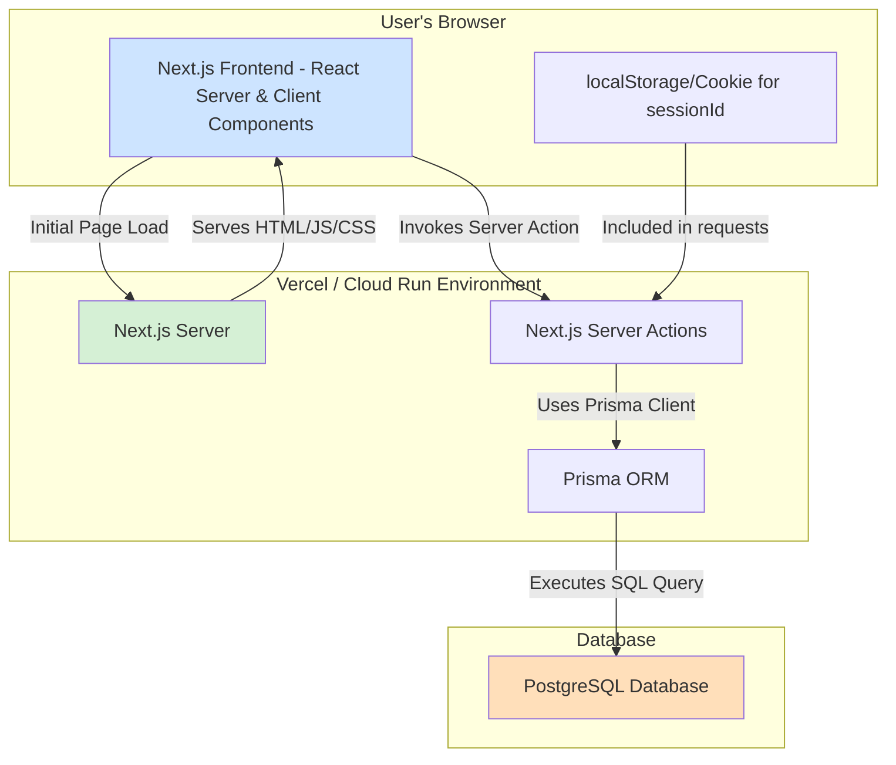

Here is the detailed technical architecture for the Zenith To-Do App, designed for direct implementation by a Code Agent.

***

## 1. Architecture Overview

Zenith is a server-rendered, single-page application built on Next.js 14 using the App Router. The architecture prioritizes performance, type safety, and a streamlined developer experience by leveraging modern web development patterns.

The system is designed around a client-server model fully contained within the Next.js framework.

-   **Frontend:** The UI is constructed with React Server Components (RSCs) for initial page loads, ensuring fast, non-interactive rendering. Client Components are used sparingly for interactive elements like forms and buttons. This hybrid approach minimizes the client-side JavaScript bundle size.
-   **Backend (API):** Backend logic for data mutation (Create, Update, Delete) is handled by **Next.js Server Actions**. These functions are co-located with their corresponding UI components and execute on the server, providing a seamless and secure way to interact with the database without manually creating API endpoints. Data fetching is done directly within Server Components using Prisma.
-   **Database:** A PostgreSQL database serves as the single source of truth. The application interacts with it through the Prisma ORM, which provides full type safety from the database to the frontend.
-   **User Identification:** For V1, user persistence is achieved without a formal login system. A unique `sessionId` is generated for each new visitor and stored in a client-side `httpOnly` cookie. All tasks created are associated with this `sessionId` in the database, allowing users to access their list across multiple sessions on the same browser.

### System Architecture Diagram (Textual Representation)



## 2. Technology Stack

| Layer | Technology | Justification |
| :--- | :--- | :--- |
| **Framework** | **Next.js 14 (App Router)** + **React 18** | Required by the prompt. The App Router with RSCs and Server Actions enables a highly performant, modern architecture with excellent developer experience. |
| **Language** | **TypeScript** | Provides end-to-end type safety, reducing runtime errors and improving code maintainability. Essential for a robust application. |
| **Styling** | **Tailwind CSS** + **shadcn/ui** | Tailwind provides a utility-first CSS framework for rapid and consistent styling. `shadcn/ui` offers beautifully designed, accessible, and composable React components built on top of Tailwind, perfectly matching the "elegant UI" requirement. |
| **API** | **Next.js Server Actions** | Simplifies data mutations by co-locating backend logic with frontend components. Reduces boilerplate and eliminates the need for manual API endpoint creation for CRUD operations. |
| **Database** | **PostgreSQL** + **Prisma ORM** | PostgreSQL is a powerful, open-source relational database. Prisma provides a best-in-class, type-safe ORM that auto-generates a client based on a declarative schema, ensuring data consistency. |
| **Deployment** | **Docker** + **Google Cloud Run** | Docker provides containerization for consistent environments. Cloud Run offers a scalable, serverless platform to run the container, simplifying deployment and management while being cost-effective. |
| **UI Feedback** | **Framer Motion** | A production-ready motion library for React. It will be used for subtle animations (e.g., list item re-ordering, fade-in/out) to enhance the user experience and provide visual feedback. |
| **Icons** | **Lucide React** | A beautiful and consistent open-source icon library, which is the default for `shadcn/ui`. |

## 3. Project Structure

The Code Agent will generate the following file tree within a `src/` directory.

```
.
├── .env
├── .eslintrc.json
├── .gitignore
├── components.json
├── docker-compose.yml
├── Dockerfile
├── next.config.mjs
├── package.json
├── postcss.config.js
├── prisma/
│   ├── migrations/
│   └── schema.prisma
├── public/
│   └── favicon.ico
├── README.md
├── src/
│   ├── app/
│   │   ├── favicon.ico
│   │   ├── globals.css
│   │   ├── layout.tsx
│   │   └── page.tsx
│   ├── actions/
│   │   └── task.actions.ts
│   ├── components/
│   │   ├── app-header.tsx
│   │   ├── task-form.tsx
│   │   ├── task-item.tsx
│   │   ├── task-list.tsx
│   │   └── ui/
│   │       ├── button.tsx
│   │       ├── checkbox.tsx
│   │       ├── dialog.tsx
│   │       ├── input.tsx
│   │       └── label.tsx
│   ├── lib/
│   │   ├── db.ts
│   │   ├── middleware.ts
│   │   └── utils.ts
│   └── types/
│       └── index.ts
├── tailwind.config.ts
└── tsconfig.json
```

## 4. Database Schema

The schema will be defined in `prisma/schema.prisma`. It contains a single model, `Task`, which is linked to an anonymous user via a `sessionId`.

```prisma
// This is your Prisma schema file,
// learn more about it in the docs: https://pris.ly/d/prisma-schema

generator client {
  provider = "prisma-client-js"
}

datasource db {
  provider = "postgresql"
  url      = env("DATABASE_URL")
}

model Task {
  id          String    @id @default(cuid())
  text        String
  completed   Boolean   @default(false)
  createdAt   DateTime  @default(now())
  updatedAt   DateTime  @updatedAt
  sessionId   String    @db.VarChar(255) // The anonymous user identifier

  @@index([sessionId])
  @@index([sessionId, completed])
}
```

## 5. API Design

CRUD operations will be handled by Server Actions defined in `src/actions/task.actions.ts`. These functions are called directly from components. There are no traditional REST API endpoints for mutations.

| Action Name | Description | Parameters | Return Value |
| :--- | :--- | :--- | :--- |
| `createTask` | Creates a new task for the current user. | `text: string` | `{ success: boolean, error?: string }` |
| `updateTaskCompletion` | Toggles the completion status of a task. | `id: string`, `completed: boolean` | `{ success: boolean, error?: string }` |
| `updateTaskText` | Updates the text content of an existing task. | `id: string`, `text: string` | `{ success: boolean, error?: string }` |
| `deleteTask` | Deletes a task. | `id: string` | `{ success: boolean, error?: string }` |

**Data Fetching:**
Data is fetched directly in `src/app/page.tsx` (a Server Component) using Prisma.

-   **Function:** `getTasks()`
-   **Description:** Fetches all tasks associated with the current user's `sessionId`.
-   **Implementation:** A simple function calling `prisma.task.findMany({ where: { sessionId } })`.

## 6. Page & Component Architecture

### **Page: Main View**

-   **Route:** `/`
-   **File:** `src/app/page.tsx`
-   **Purpose:** The main and only page of the application. Displays the header, the task creation form, and the list of active and completed tasks.
-   **Type:** Server Component.
-   **API Calls (Server-Side):**
    -   Reads the `sessionId` from the request cookies.
    -   Calls `prisma.task.findMany()` to fetch all tasks for that `sessionId`.
-   **Components Used:**
    -   `<AppHeader />`
    -   `<TaskForm />`
    -   `<TaskList />`

### **Reusable Components**

**1. `<AppHeader />`**
-   **File:** `src/components/app-header.tsx`
-   **Purpose:** Displays the application title "Zenith".
-   **Props:** None.
-   **Variants:** None.
-   **Used In:** `src/app/page.tsx`

**2. `<TaskForm />`**
-   **File:** `src/components/task-form.tsx`
-   **Purpose:** An inline form to create a new task.
-   **Type:** Client Component (uses `useState` and form handlers).
-   **Props:** None.
-   **User Interactions:**
    -   User types a new task in an `<Input />` field.
    -   Pressing "Enter" or clicking an "Add" button triggers the `createTask` Server Action.
    -   The form should use the `useOptimistic` hook to immediately add the new task to the UI in a pending state.
-   **Used In:** `src/app/page.tsx`

**3. `<TaskList />`**
-   **File:** `src/components/task-list.tsx`
-   **Purpose:** Renders the list of tasks, separating "Active" and "Completed" tasks.
-   **Type:** Client Component (to handle optimistic updates passed from the parent).
-   **Props:**
    -   `tasks: Task[]` (The full list of tasks from the database).
-   **Logic:**
    -   Receives the list of tasks and optimistic update functions/state from `page.tsx`.
    -   Filters tasks into two groups: `activeTasks` (`completed: false`) and `completedTasks` (`completed: true`).
    -   Renders the `activeTasks` list.
    -   Renders a "Completed" separator/header.
    -   Renders the `completedTasks` list, which should be visually distinct (e.g., grayed out, strikethrough text).
    -   Each task is rendered using the `<TaskItem />` component.
-   **Used In:** `src/app/page.tsx`

**4. `<TaskItem />`**
-   **File:** `src/components/task-item.tsx`
-   **Purpose:** Displays a single to-do item.
-   **Type:** Client Component (handles user interactions).
-   **Props:**
    -   `task: Task` (The task object: `{ id, text, completed }`).
-   **User Interactions & Visual States:**
    -   **Checkbox:** A `shadcn/ui` `<Checkbox />` on the left. Clicking it triggers the `updateTaskCompletion` Server Action.
    -   **Task Text:** The task's text. Clicking on the text could make it editable (inline edit) or open an edit modal (TBD by implementation, inline is preferred for simplicity). Editing triggers `updateTaskText`.
    -   **Delete Button:** A small 'x' icon (`Trash2` from Lucide) appears on hover. Clicking it triggers the `deleteTask` Server Action.
    -   **Completed State:** If `task.completed` is true, the component applies `line-through` and `text-muted-foreground` classes to the text.
    -   **Animation:** The component should have a subtle fade-in animation when added to the list and a fade-out when deleted, using `framer-motion`.
-   **Used In:** `<TaskList />`

### **UI/shadcn Components**
These will be generated by the `shadcn/ui` CLI and placed in `src/components/ui/`.
-   `button.tsx`
-   `checkbox.tsx`
-   `input.tsx`
-   `label.tsx`
-   `dialog.tsx` (For potential future use, e.g., an "edit task" modal).

## 7. Authentication & Authorization

For V1, there is no user authentication in the traditional sense (no email/password or OAuth).

-   **Anonymous User Identification:**
    1.  A Next.js Middleware (`src/lib/middleware.ts`) will inspect incoming requests for a cookie named `zenith-session-id`.
    2.  If the cookie is not present, the middleware generates a new UUID (`crypto.randomUUID()`).
    3.  It sets this UUID in an `httpOnly`, `secure`, `sameSite: 'lax'` cookie in the response.
    4.  This `sessionId` is then available to all Server Components and Server Actions via the `cookies()` function from `next/headers`.
-   **Authorization:** There is no role-based access control. All operations (Create, Read, Update, Delete) are authorized as long as they are associated with the `sessionId` present in the request's cookie. A task can only be modified or deleted by the user whose browser holds the matching `sessionId`. This is enforced in the `where` clause of every Prisma query within the Server Actions.

## 8. Deployment Architecture

-   **`Dockerfile`:** A multi-stage Dockerfile will be used to create an optimized production image.
    -   **`deps` stage:** Installs dependencies.
    -   **`builder` stage:** Copies source code, builds the Next.js application (`npm run build`).
    -   **`runner` stage:** Copies only the necessary built artifacts (`.next` standalone output, `public`, `node_modules`) from the builder stage into a lean Node.js image. This results in a smaller, more secure final image.
-   **`docker-compose.yml`:** For local development, this file will orchestrate the Next.js app container and a PostgreSQL database container, connecting them on a shared network.
-   **Cloud Run Configuration:**
    -   **Source:** The built Docker image will be pushed to Google Artifact Registry.
    -   **Trigger:** Continuous Deployment will be set up to automatically deploy new images pushed to the main branch.
    -   **Environment Variables:** `DATABASE_URL` will be configured as a secret, injected from Google Secret Manager.
    -   **Instance Settings:** Configured for CPU to be allocated only during request processing, with a minimum of 1 instance to handle traffic spikes and a maximum based on budget.

## 9. Security Considerations

-   **Input Validation:** All user-provided input (e.g., new task text) will be validated on the server within the Server Actions. Libraries like `zod` will be used to define schemas for expected data, preventing invalid or malicious data from reaching the database.
-   **Cross-Site Scripting (XSS):** React automatically escapes content rendered in JSX, mitigating XSS risks. All data will be rendered as text, not raw HTML.
-   **CORS:** Not a major concern as the "API" (Server Actions) and the frontend are same-origin. The Next.js default configuration is sufficient.
-   **Secrets Management:** The `DATABASE_URL` and any other secrets will be managed via environment variables. They will NOT be hardcoded. In production (Cloud Run), they will be injected from a secure secret manager. The `.env` file is for local development only and will be listed in `.gitignore`.
-   **Authorization Logic:** Every database query in the Server Actions **MUST** include a `where` clause filtering by `sessionId` to ensure users can only access and modify their own tasks.
    -   Example: `prisma.task.delete({ where: { id: taskId, sessionId: userSessionId } })`.

## 10. Architecture Risks & Trade-offs

-   **Anonymous Persistence:** The `sessionId`-in-cookie approach is simple but has limitations. Data is tied to a specific browser. If a user clears their cookies or switches devices, their task list is lost. This is an accepted trade-off for V1 to meet the "simple, anonymous" requirement but is the primary candidate for improvement in V2 (implementing full user accounts with NextAuth.js).
-   **Vendor Lock-in (Vercel/Cloud Run):** While deploying to a specific serverless platform is convenient, it creates a degree of dependency. However, since the application is containerized with Docker, migrating to another container-based platform (e.g., AWS Fargate, Azure Container Apps) is straightforward.
-   **Server Actions as a New Technology:** Server Actions are a relatively new paradigm. While stable in Next.js 14, best practices are still evolving. This architecture fully embraces them for their benefits, accepting the risk of potential paradigm shifts in future Next.js versions.
-   **No Offline Support:** This is a purely online application. If the user loses their internet connection, they cannot interact with their task list. Implementing offline support (e.g., with Service Workers and IndexedDB) is a significant undertaking and is out of scope for V1.